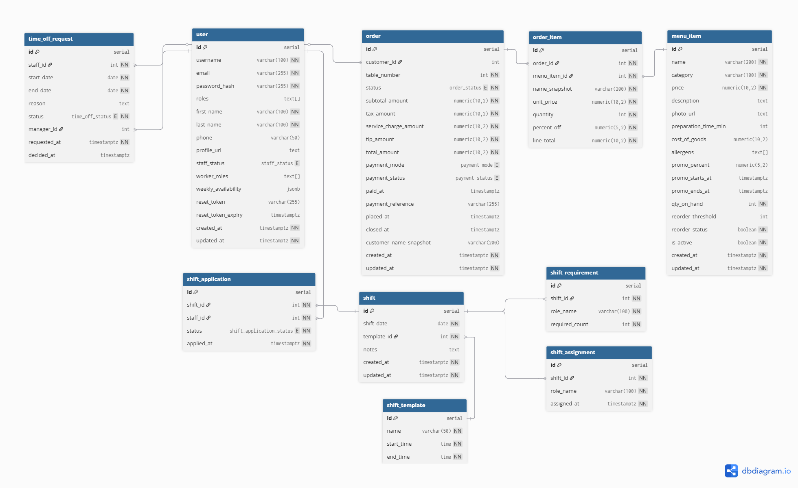

# Restaurant Management Suite - Requirements Specification

## Technology Stack

### Frontend
- **Framework**: React.js
- **State Management**: React Context API
- **UI Components**: HeroUI
- **API Client**: Axios/React Query
- **Charts**: Chart.js/React Charts

### Backend
- **Framework**: Express.js with TypeScript
- **ORM**: TypeORM
- **Authentication**: JWT (JSON Web Tokens)
- **API Documentation**: Swagger/OpenAPI
- **Validation**: Joi/Zod

### Database
- **RDBMS**: PostgreSQL
- **ORM**: TypeORM
- **Migrations**: TypeORM Migrations

### DevOps
- **Containerization**: Docker
- **Version Control**: Git
- **API Testing**: Jest/Supertest

## Functional Requirements

### 1. User Authentication & Authorization
- User Registration with email verification
- Secure Login/Logout functionality
- Role-Based Access Control (RBAC) with four roles:
  - Customer (menu view only)
  - Staff/Server (schedule access)
  - Manager (full system access)
  - Admin (system configuration access)
- Password reset functionality
- Profile management system
- Secure password hashing (bcrypt)
- JWT token management

### 2. Menu Management System
- CRUD operations for menu items
- Menu categorization (appetizers, mains, desserts, beverages)
- Image upload for menu items
- Availability toggling
- Dynamic pricing and discounts
- Search and filtering capabilities
- Multi-language support (optional)

### 3. Staff Scheduling System
- Weekly schedule creation and management
- Staff shift assignment
- Role-based shift management
- Schedule viewing interface
- Shift coverage tracking
- Visual calendar interface
- Double-booking prevention
- Schedule change notifications

### 4. Reporting & Analytics Dashboard
- Popular items tracking
- Staff utilization analytics
- Menu performance metrics
- System usage reports
- Data visualization
- Export functionality (CSV/PDF)

## Non-Functional Requirements

### 1. Security
- Input validation and sanitization
- XSS prevention
- CORS configuration
- Secure headers implementation
- Rate limiting
- Secure session management
- Password hashing with bcrypt
- JWT token security

### 2. Performance
- Response time < 2 seconds
- Support for multiple concurrent users
- Efficient database queries
- Proper indexing
- Caching implementation
- Optimized image storage

### 3. Scalability
- Modular architecture
- Containerized deployment
- Horizontal scaling capability
- Database connection pooling
- Load balancing ready

### 4. Reliability
- Error handling
- Data backup
- Fault tolerance
- System monitoring
- Error logging

### 5. Usability
- Responsive design
- Cross-browser compatibility
- Intuitive navigation
- Clear error messages
- Loading indicators
- Confirmation dialogs
- Help documentation

### 6. Maintainability
- Code documentation
- API documentation
- Version control
- Coding standards
- Modular design
- Testing coverage

### 7. Data Management
- Data validation
- Referential integrity
- Regular backups
- Data migration support
- Audit logging

### 8. DevOps
- Docker containerization
- Environment configuration
- Deployment automation
- Monitoring setup
- CI/CD pipeline ready

## Testing Requirements
- Unit testing
- Integration testing
- API testing
- Security testing
- Performance testing
- User acceptance testing

## Documentation Requirements
- Setup instructions
- API documentation
- User manual
- System architecture
- Database schema
- Deployment guide
- Testing documentation

## Entity Relationships Diagram

### Relationships between tables
User ↔ Order: Orders are placed by users (customers), and staff identities can appear in scheduling and time-off requests.

Order ↔ OrderItem ↔ MenuItem: Each order contains multiple order items, which reference menu items for analytics.

ShiftTemplate ↔ Shift: Each shift belongs to one daily template (Morning/Afternoon/Evening).

Shift ↔ ShiftRequirement: A shift has multiple role requirements (role name + headcount).

Shift ↔ ShiftApplication ↔ User: Staff users apply to shifts via applications.

ShiftRequirement ↔ ShiftAssignment ↔ User: Assignments link staff users to specific role requirements in a shift.

User ↔ TimeOffRequest: Staff request time off, and managers (also users) approve or deny it.